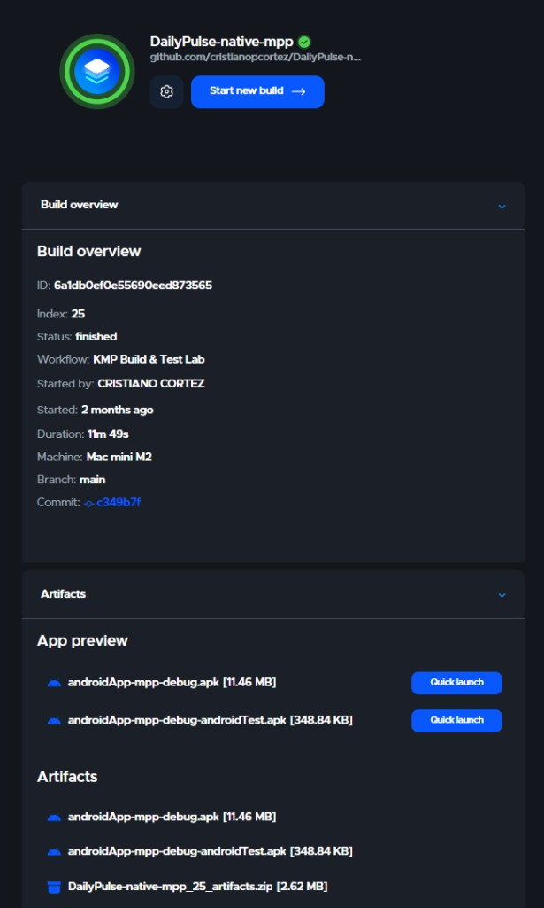
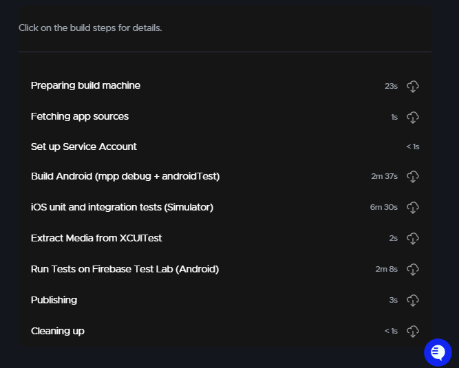
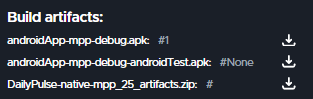

# DailyPulse — Edição de Portfólio em KMP

**CI (Codemagic):** [`kmp-workflow`](./codemagic.yaml) em `main` — [visão da pipeline e screenshots](#integração-contínua-codemagic) abaixo.

[Read this in English →](./README.md)

> Um leitor de notícias que demonstra **duas formas de construir UI em cima do mesmo núcleo de negócio em Kotlin Multiplatform**:
> 1. **Compose Multiplatform** — uma única árvore de UI Kotlin/Compose entregue para Android, iOS, Desktop e Web.
> 2. **UI Nativa** — Jetpack Compose no Android e SwiftUI no iOS, cada uma consumindo as mesmas ViewModels compartilhadas.

O objetivo desta versão **não é ensinar KMP do zero**; é **mostrar, em um único repositório, os trade-offs arquiteturais entre compartilhar a UI e mantê-la nativa**, reaproveitando 100% da lógica de negócio.

---

## Integração contínua (Codemagic)

Pushes para **`main`** disparam o pipeline [`kmp-workflow`](./codemagic.yaml) (**KMP Build & Test Lab**). A esteira:

- Gera o app Android **mpp** debug e o APK de testes instrumentados
- Roda testes **iOS** no simulador (unitários + UI, com extração de mídia do XCUITest)
- Executa testes instrumentados no **Firebase Test Lab** (Android)

As páginas de build no Codemagic exigem login, então os screenshots abaixo documentam a última execução bem-sucedida para quem navega o repositório no GitHub.

### Última execução bem-sucedida (build #25 · `main` · `c349b7f`)

**Visão geral** — concluído em ~12 minutos em Mac mini M2:



**Etapas da pipeline:**



**Artefatos publicados** (APKs e pacote de saída da CI):



---

## Cursos (Udemy)

O repositório de exercícios **DailyPulse** original e os branches progressivos são do **Petros Efthymiou**. Os cursos abaixo são **pagos** na Udemy:

1. [**Kotlin Multiplatform Masterclass — KMP, KMM — Android, iOS**](https://www.udemy.com/course/kotlin-multiplatform-masterclass/)
2. [**Full-stack Compose Multiplatform Masterclass — KMP**](https://www.udemy.com/course/fullstack-compose-multiplatform-masterclass-kmp/)

Código upstream: [github.com/petros-efthymiou/DailyPulse](https://github.com/petros-efthymiou/DailyPulse). Este fork acrescenta os flavors Android `native` / `mpp`, o switch de UI no iOS e documentação voltada ao portfólio.

---

## Sumário

- [Integração contínua (Codemagic)](#integração-contínua-codemagic)
- [Cursos (Udemy)](#cursos-udemy)
- [Testes](#testes)
- [O que é compartilhado, o que é por flavor](#o-que-é-compartilhado-o-que-é-por-flavor)
- [Build flavors em um relance](#build-flavors-em-um-relance)
- [Estrutura do projeto](#estrutura-do-projeto)
- [Stack tecnológico](#stack-tecnológico)
- [Arquitetura](#arquitetura)
- [Backend (BFF)](#backend-bff)
- [Como executar](#como-executar)
  - [Android — `mpp` (Compose Multiplatform)](#android--mpp-compose-multiplatform)
  - [Android — `native` (Jetpack Compose)](#android--native-jetpack-compose)
  - [iOS — `mpp` (Compose Multiplatform)](#ios--mpp-compose-multiplatform)
  - [iOS — `native` (SwiftUI)](#ios--native-swiftui)
- [Como o switch de flavor funciona](#como-o-switch-de-flavor-funciona)
- [Verificando dependências do Gradle](#verificando-dependências-do-gradle)
- [Branches do curso (referência)](#branches-do-curso-referência)
- [Autor](#autor)
- [Licença](#licença)

---

## Testes

O DailyPulse demonstra uma **estratégia de testes multi-camadas de nível produção** que elimina testes instáveis e dependências externas através de mocking inteligente de rede.

### 🎯 Arquitetura de Testes

| Camada | Ferramenta | Velocidade | Device? | Cobertura | Testes |
|--------|-----------|-----------|---------|-----------|--------|
| **Unitários** | `ktor-client-mock` | ⚡⚡⚡ ~10s | Não | Services, repos, use cases | 7 testes |
| **Instrumentados** | `MockWebServer` | ⚡⚡ ~60s | Emulador/Device | Fluxos E2E, estados de erro | 5 testes |
| **Firebase Test Lab** | `MockWebServer` | ⚡ ~5min | Devices reais | Compatibilidade | Mesmos que instrumentados |

**Total: 12 testes automatizados** rodando de forma determinística sem qualquer backend externo.

### 🚀 Quick Start

```bash
# Testes unitários (rápido, sem device)
./gradlew :shared:testDebugUnitTest

# Testes instrumentados (requer emulador ou device físico)
./gradlew :androidApp:connectedMppDebugAndroidTest

# Gerar APKs para Firebase Test Lab
./gradlew :androidApp:assembleMppDebug :androidApp:assembleMppDebugAndroidTest
```

### ✨ Inovações Principais

#### 1. **TestBffConfig** - Override de URL em Runtime
```kotlin
// Produção: usa URL compilada em tempo de build
TestBffConfig.getGraphqlUrl() // http://10.0.2.2:8080/graphql

// Testes: MockWebServer injeta sua URL em runtime
TestBffConfig.setOverride("http://127.0.0.1:12345")
TestBffConfig.getGraphqlUrl() // http://127.0.0.1:12345/graphql
```
Sem necessidade de build flavors ou flags de compilação—testes injetam URLs mock sem atrito.

#### 2. **Dispatcher Inteligente do MockWebServer**
```kotlin
mockWebServer.dispatcher = object : Dispatcher() {
    override fun dispatch(request: RecordedRequest): MockResponse {
        val body = request.body.readUtf8()
        return when {
            body.contains("articles") -> MockResponse().setBody(ARTICLES_JSON)
            body.contains("sources") -> MockResponse().setBody(SOURCES_JSON)
            body.contains("aggregators") -> MockResponse().setBody(AGGREGATORS_JSON)
            else -> MockResponse().setResponseCode(404)
        }
    }
}
```
Um único mock server lida com todas as queries GraphQL automaticamente.

#### 3. **Test Runner Customizado** - Injeção de DI Antes da Init
```kotlin
class DailyPulseTestRunner : AndroidJUnitRunner() {
    override fun newApplication(...): Application {
        return super.newApplication(cl, TestDailyPulseApp::class.java.name, context)
    }
}
```
Injeta módulos Koin de teste antes do app inicializar, permitindo override completo de DI.

### 📊 Impacto & Resultados

#### Antes da Implementação de Testes
- ❌ Apenas 1 smoke test (`MainActivity` abre)
- ❌ Requeria BFF externo rodando (`http://10.0.2.2:8080`)
- ❌ Execuções flaky na CI por dependências de rede
- ❌ Setup manual necessário (~10 minutos)
- ❌ Zero cobertura para parsing GraphQL, estados de erro, fluxos de UI

#### Depois da Implementação de Testes
- ✅ **12 testes automatizados** (7 unitários + 5 instrumentados)
- ✅ **Zero dependências externas** - todos os testes autocontidos
- ✅ **100% determinísticos** - mesmos resultados a cada execução
- ✅ **Zero configuração** - apenas `./gradlew test`
- ✅ **Estáveis em devices físicos** - testado em Moto G(6) Plus, múltiplos emuladores
- ✅ **Prontos para CI** - passando consistentemente no Codemagic e Firebase Test Lab
- ✅ **Bem documentados** - 2.600+ linhas de guias e exemplos

### 🧪 O que é Testado

#### Testes Unitários (`shared/src/commonTest/`)
- ✅ **ArticlesServiceTest** (4 testes)
  - Parsing de respostas GraphQL
  - Listas de artigos vazias
  - Passagem de variáveis (aggregator, source)
  - Tratamento de erros
- ✅ **SourcesServiceTest** (3 testes)
  - Parsing de sources
  - Filtro de aggregator
  - Respostas vazias

#### Testes Instrumentados (`androidApp/src/androidTest/`)
- ✅ **ArticlesScreenTest** (3 testes)
  - Artigos exibidos do MockWebServer
  - Renderização de descrições
  - Estados de loading
- ✅ **ArticlesScreenErrorTest** (2 testes)
  - Exibição de mensagens de erro
  - Tratamento de estado vazio

Todos os testes usam **fixtures centralizados** (`GraphqlFixtures.kt`, `AndroidGraphqlFixtures.kt`) para dados de teste manuteníveis.

### 📁 Infraestrutura de Testes

```
DailyPulse/
├── shared/src/
│   ├── commonMain/.../network/
│   │   └── TestBffConfig.kt              # Override de URL em runtime
│   └── commonTest/
│       ├── fixtures/GraphqlFixtures.kt    # Dados de teste centralizados
│       ├── articles/data/
│       │   └── ArticlesServiceTest.kt     # 4 testes unitários
│       └── sources/data/
│           └── SourcesServiceTest.kt      # 3 testes unitários
│
└── androidApp/src/androidTest/
    ├── DailyPulseTestRunner.kt            # AndroidJUnitRunner customizado
    ├── TestDailyPulseApp.kt               # Aplicação de teste com override de DI
    ├── di/TestKoinModules.kt              # Configuração Koin para testes
    ├── fixtures/AndroidGraphqlFixtures.kt # Dados para testes de UI
    └── screens/
        ├── ArticlesScreenTest.kt          # 3 testes de UI
        └── ArticlesScreenErrorTest.kt     # 2 testes de erro
```

### 🎓 Documentação Completa

Guias completos de testes disponíveis em [`docs/testing/`](./docs/testing/):

| Documento | Descrição | Linhas |
|-----------|-----------|--------|
| **[README.md](./docs/testing/README.md)** | Quick start, overview e arquitetura | 400+ |
| **[TESTING_STRATEGY.md](./docs/testing/TESTING_STRATEGY.md)** | Estratégia detalhada, rationale, migração | 650+ |
| **[RUNNING_TESTS.md](./docs/testing/RUNNING_TESTS.md)** | Guia prático com troubleshooting | 420+ |
| **[IMPLEMENTATION_SUMMARY.md](./docs/testing/IMPLEMENTATION_SUMMARY.md)** | Referência completa da estrutura | 280+ |
| **[QUICK_REFERENCE.md](./docs/testing/QUICK_REFERENCE.md)** | Cheat sheet de comandos | 150+ |
| **[RESUMO_PT-BR.md](./docs/testing/RESUMO_PT-BR.md)** | Resumo executivo em português | 450+ |

**Total: 2.600+ linhas de documentação** com exemplos, diagramas e guias de troubleshooting.

### 🔧 Testes em Devices Físicos

Os testes são **estáveis em devices físicos** (validado em Moto G(6) Plus, API 28):

- Usa `assertExists()` ao invés de `assertIsDisplayed()` para clipping de viewport
- `waitUntil` com timeout de 10s para fluxo assíncrono de dados (Network → SQLDelight → StateFlow → UI)
- `performScrollToNode()` para itens LazyColumn abaixo da dobra
- Lida com insets de TopAppBar e variações de layout específicas do device
- Resolução explícita de dependência OkHttp 4.12.0 para prevenir `NoClassDefFoundError`
- Limpeza de database no setup de teste garante isolamento

### 📦 Dependências

```kotlin
// gradle/libs.versions.toml
ktor-client-mock = "3.5.2"    // Mocking para testes unitários
mockwebserver = "4.12.0"       // Mocking para testes instrumentados
turbine = "1.2.0"              // Testes de Flow (uso futuro)
```

### 🎯 Por que Isso Importa para Projetos de Portfólio

Esta infraestrutura de testes demonstra:

1. **Práticas de teste de nível produção** - não apenas exemplos de brinquedo
2. **Entendimento de pirâmides de teste** - testes unitários rápidos, testes E2E estratégicos
3. **Resolução de problemas reais** - testes flaky, dependências externas, variações de device
4. **Habilidades de documentação** - guias completos para onboarding de equipe
5. **Integração CI/CD** - testes automatizados em pipelines reais
6. **Testes multiplataforma** - testando lógica de negócio compartilhada em KMP

Showcase perfeito para posições de **engenharia mobile sênior** que requerem:
- Testes de Clean Architecture
- Testes de injeção de dependência
- Estratégias de mocking de rede
- Design de pipeline CI/CD
- Documentação técnica

---

```text
┌─────────────────────────────────────────────────────────────────┐
│   :shared (Kotlin Multiplatform)                                │
│                                                                 │
│   commonMain                                                    │
│     ├── articles/  sources/   (UseCases, Repositories, DTOs)    │
│     ├── presentation/         (ArticlesViewModel, *State)       │
│     ├── di/                   (Módulos Koin)                    │
│     ├── db/                   (Schema SQLDelight)               │
│     └── ui/                   (Telas Compose Multiplatform)     │
│                               (consumido só pelo flavor mpp)    │
│                                                                 │
│   androidMain   iosMain   (Engine Ktor, driver SQL, Platform)   │
└─────────────────────────────────────────────────────────────────┘
                              ▲                ▲
                              │                │
                ┌─────────────┘                └────────────┐
                │                                           │
   ┌────────────┴──────────┐                  ┌─────────────┴───────────┐
   │  androidApp           │                  │  iosApp                 │
   │  ┌────────┐ ┌───────┐ │                  │  ┌─────────┐ ┌────────┐ │
   │  │ src/   │ │ src/  │ │                  │  │ Content │ │ Native │ │
   │  │ mpp/   │ │native/│ │                  │  │ View    │ │ Root   │ │
   │  │  └ App │ │ └ JC  │ │                  │  │ (CMP)   │ │ View   │ │
   │  └────────┘ └───────┘ │                  │  └─────────┘ └────────┘ │
   └───────────────────────┘                  └─────────────────────────┘
        Android Product Flavors                  Flag de compilação Swift
        (mpp / native)                           (-D MPP_UI)
```

Tudo **da ViewModel para baixo** vive em `:shared/commonMain` e é reaproveitado pelos dois flavors. As duas variantes de UI só diferem em *como o mesmo `ArticlesViewModel.articlesState` é renderizado*.

---

## Build flavors em um relance

| Flavor | UI Android | UI iOS | Carregamento de imagens | Navegação | Application ID |
|--------|------------|--------|--------------------------|-----------|----------------|
| `mpp`    | `App()` em Compose Multiplatform vindo de `:shared` | `MainViewController()` de `:shared` (envelopado em `UIViewControllerRepresentable`) | Kamel | Voyager | `…dailypulse.android.mpp` |
| `native` | Jetpack Compose escrito em `androidApp/src/native/` | Telas SwiftUI em `iosApp/iosApp/Screens/` | Coil (Android), `AsyncImage` (iOS) | `androidx.navigation.compose` (Android), `NavigationStack` (iOS) | `…dailypulse.android.native` |

Os dois flavors do Android instalam lado a lado porque possuem application IDs distintos.

---

## Estrutura do projeto

```text
DailyPulse/
├── shared/                                  # Módulo Kotlin Multiplatform
│   └── src/
│       ├── commonMain/kotlin/.../
│       │   ├── articles/                    # lógica de negócio (use cases, repo, VM)
│       │   ├── sources/
│       │   ├── di/                          # Módulos Koin (compartilhados)
│       │   ├── db/                          # Banco SQLDelight
│       │   └── ui/                          # Telas Compose Multiplatform (só mpp)
│       ├── androidMain/                     # Engine Ktor Android, driver SQL
│       └── iosMain/                         # Engine Ktor Darwin, driver SQL,
│                                            # KoinInitializer, MainViewController
│
├── androidApp/
│   └── src/
│       ├── main/                            # AndroidManifest, Application,
│       │                                    # módulos Koin compartilhados
│       ├── mpp/java/.../                    # ⇨ MainActivity que hospeda App() do shared
│       └── native/java/.../                 # ⇨ MainActivity + telas Jetpack Compose
│
├── iosApp/
│   └── iosApp/
│       ├── iOSApp.swift                     # Faz o switch via #if MPP_UI
│       ├── ContentView.swift                # Entrada MPP (UIViewControllerRepresentable)
│       ├── NativeRootView.swift             # Entrada nativa (NavigationStack)
│       └── Screens/                         # Telas SwiftUI (consumidas pelo native)
│
└── gradle/libs.versions.toml                # Fonte única da verdade para versões
```

---

## Stack tecnológico

| Camada | Biblioteca |
|--------|------------|
| Build | Gradle 9.5.1, AGP 8.13.2, JDK 17 |
| Linguagem | Kotlin 2.4.10 (K2), Swift 5 |
| Async | kotlinx.coroutines 1.11, kotlinx.datetime 0.8 (`kotlin.time`) |
| Networking | Ktor 3.5 (engine Android + engine Darwin) → BFF GraphQL (não a NewsAPI) |
| Persistência | SQLDelight 2.3 |
| Injeção de dependências | Koin 4.2 (`koin-core`, `koin-android`, `koin-compose`, `koin-androidx-compose`) |
| UI — flavor `mpp` | Compose Multiplatform 1.11.1, Voyager 2.2, Kamel 1.0 |
| UI — flavor `native` (Android) | Jetpack Compose (Material 3 1.4.0), `androidx.navigation.compose`, Coil |
| UI — flavor `native` (iOS) | SwiftUI, `NavigationStack`, `AsyncImage` |

---

## Arquitetura

```
┌─────────────────────────────────────────────────────────────┐
│  UI (Compose Multiplatform │ Jetpack Compose │ SwiftUI)     │  ← por flavor
├─────────────────────────────────────────────────────────────┤
│  Apresentação — ArticlesViewModel, SourcesViewModel          │  ── compartilhado
│  Aplicação    — UseCases, modelos de domínio                 │  ── compartilhado
│  Dados        — Repositórios, serviço Ktor, SQLDelight       │  ── compartilhado
│  Infra        — Platform, drivers de DB, engine Ktor         │  ── por plataforma
└─────────────────────────────────────────────────────────────┘
```

O padrão é **Clean Architecture + estado no estilo MVI**, com um único `StateFlow<XxxState>` por tela. Pull-to-refresh, tratamento de erro e estados de loading vivem no código compartilhado.

---

## Backend (BFF)

Articles e Sources vêm de um **BFF GraphQL** (Ktor); o cliente não chama a NewsAPI. O app Android (e o iOS, via `:shared`) faz `POST /graphql`.

Repositório do BFF: **[github.com/cristianopcortez/daily-pulse-bff](https://github.com/cristianopcortez/daily-pulse-bff)**

Suba o BFF localmente (`./gradlew run`, porta **8080**) antes de abrir o app. Defaults de debug: emulador Android `http://10.0.2.2:8080`, iOS Simulator `http://localhost:8080`. Override opcional de máquina no `local.properties` (gitignorado):

```properties
bff.base.url=http://192.168.x.x:8080
```

A tela About continua 100% local no device.

---

## Como executar

### Pré-requisitos

- JDK 17
- Android Studio Hedgehog (ou superior) com Android SDK 34
- Xcode 15+ (para os alvos iOS)
- Um `local.properties` com `sdk.dir=…`
- O [Daily Pulse BFF](https://github.com/cristianopcortez/daily-pulse-bff) rodando localmente na porta 8080 (veja [Backend (BFF)](#backend-bff))

### Android — `mpp` (Compose Multiplatform)

```bash
./gradlew :androidApp:assembleMppDebug
./gradlew :androidApp:installMppDebug         # instala em um device conectado
```

Ou, no Android Studio:

1. Abra a janela Build Variants (`View → Tool Windows → Build Variants`).
2. Para o módulo `androidApp`, escolha a variant **`mppDebug`**.
3. Rode a configuração `androidApp`.

O application ID deste flavor é `com.petros.efthymiou.dailypulse.android.mpp`, então ele convive com o flavor nativo no mesmo device.

### Android — `native` (Jetpack Compose)

```bash
./gradlew :androidApp:assembleNativeDebug
./gradlew :androidApp:installNativeDebug
```

Ou escolha a variant **`nativeDebug`** no painel Build Variants.

Esse flavor usa `androidx.compose.material3`, `androidx.navigation.compose`, Coil e `koin-androidx-compose`. Ele **não** depende de Compose Multiplatform, Voyager ou Kamel.

### iOS — `mpp` (Compose Multiplatform)

O framework iOS é construído pelo Gradle e consumido pelo Xcode:

```bash
./gradlew :shared:embedAndSignAppleFrameworkForXcode
```

Em seguida, no Xcode:

1. Abra `iosApp/iosApp.xcodeproj`.
2. Selecione o target `iosApp` → **Build Settings** → **Other Swift Flags**.
3. Adicione `-D MPP_UI` para as configurações *Debug* e *Release* do **scheme MPP** (veja abaixo).
4. Rode o scheme `iosApp`.

`iOSApp.swift` vai escolher `ContentView()`, que envelopa o `MainViewController()` Kotlin — exatamente a mesma árvore Compose Multiplatform que roda no Android.

### iOS — `native` (SwiftUI)

1. Abra `iosApp/iosApp.xcodeproj`.
2. Garanta que `MPP_UI` **não** esteja definido em *Other Swift Flags* (esse é o padrão).
3. Rode o scheme `iosApp`.

`iOSApp.swift` vai escolher `NativeRootView()`, que renderiza as telas SwiftUI em `iosApp/iosApp/Screens/`. Elas consomem `ArticlesViewModel`, `SourcesViewModel` e `Platform` direto do framework compartilhado, via os helpers `*Injector` (Koin).

> **Setup recomendado no Xcode**: duplique o scheme padrão `iosApp` em dois — `iosApp-MPP` e `iosApp-Native`. Adicione `-D MPP_UI` em *Other Swift Flags* só no `iosApp-MPP`. A partir daí, alternar de flavor no iOS é um clique.

---

## Como o switch de flavor funciona

### Android (Gradle product flavors)

```kotlin
// androidApp/build.gradle.kts
android {
    flavorDimensions += "ui"
    productFlavors {
        create("mpp") {
            dimension = "ui"
            applicationIdSuffix = ".mpp"
            buildConfigField("String", "FLAVOR_LABEL", "\"Compose Multiplatform\"")
        }
        create("native") {
            dimension = "ui"
            applicationIdSuffix = ".native"
            buildConfigField("String", "FLAVOR_LABEL", "\"Jetpack Compose (Native)\"")
        }
    }
}

dependencies {
    "mppImplementation"(libs.koin.compose)
    "nativeImplementation"(libs.androidx.navigation.compose)
    "nativeImplementation"(libs.coil.compose)
    "nativeImplementation"(libs.koin.androidx.compose)
    "nativeImplementation"(libs.androidx.compose.material) // pull-to-refresh
}
```

A `MainActivity` **não** fica em `src/main/`. Ela existe uma vez em `src/mpp/java/…` (delegando para `App()` do `:shared`) e uma vez em `src/native/java/…` (montando um grafo `androidx.navigation.compose`). O `AndroidManifest.xml` e a Application class `DailyPulseApp` ficam em `src/main/` e são compartilhados.

### iOS (flag de compilação Swift)

```swift
// iosApp/iosApp/iOSApp.swift
@main
struct iOSApp: App {
    init() { KoinInitializerKt.doInitKoin() }
    var body: some Scene {
        WindowGroup {
            #if MPP_UI
            ContentView()        // Compose Multiplatform
            #else
            NativeRootView()     // SwiftUI
            #endif
        }
    }
}
```

A entrada MPP é o `ContentView` original que envelopa `MainIOSKt.MainViewController()`. A entrada nativa é o novo `NativeRootView`, que coloca as telas SwiftUI existentes (`ArticlesScreen`, `SourcesScreen`, `AboutScreen`) dentro de um `NavigationStack`.

---

## Verificando dependências do Gradle

O catálogo `gradle/libs.versions.toml` é a fonte única da verdade. As adições relevantes para esta versão de portfólio são:

| Chave | Usado por | Propósito |
|-------|-----------|-----------|
| `androidx-navigation-compose` | `nativeImplementation` | Navegação no flavor nativo |
| `coil-compose` | `nativeImplementation` | Carregamento de imagens no flavor nativo |
| `koin-androidx-compose` | `nativeImplementation` | `koinViewModel()` em `@Composable`s |
| `androidx-compose-material` | `nativeImplementation` | APIs `pullrefresh` no flavor nativo |
| `koin-compose` | `mppImplementation` | `koinInject()` dentro de Compose Multiplatform |
| `compose.runtime/foundation/material3`, `voyager-*`, `kamel-image` | `:shared/commonMain` | UI Compose Multiplatform consumida pelo flavor mpp |

Para provar que a matriz compila ponta a ponta:

```bash
./gradlew :androidApp:assembleMppDebug :androidApp:assembleNativeDebug
```

Você deve ver dois APKs distintos:

```
androidApp/build/outputs/apk/mpp/debug/androidApp-mpp-debug.apk
androidApp/build/outputs/apk/native/debug/androidApp-native-debug.apk
```

### Testes instrumentados Android / Firebase Test Lab

Para gerar o app **mpp** debug e o APK de testes instrumentados (o mesmo par usado no `codemagic.yaml` para o Firebase Test Lab):

```bash
./gradlew :androidApp:assembleMppDebug :androidApp:assembleMppDebugAndroidTest
```

Com dispositivo ou emulador conectado:

```bash
./gradlew :androidApp:connectedMppDebugAndroidTest
```

Para `gcloud firebase test android run --type instrumentation`, o APK do **app** fica em `outputs/apk/<flavor>/debug/`, mas o APK de **teste** é gerado em `outputs/apk/androidTest/...` (não ao lado do app):

```
androidApp/build/outputs/apk/mpp/debug/androidApp-mpp-debug.apk
androidApp/build/outputs/apk/androidTest/mpp/debug/androidApp-mpp-debug-androidTest.apk
```

No flavor **native**, use `assembleNativeDebug` / `assembleNativeDebugAndroidTest` (ou `connectedNativeDebugAndroidTest`) e troque `mpp` por `native` nos dois caminhos.

---

## Branches do curso (referência)

Esta versão de portfólio foi construída em cima das branches originais do curso. Elas são preservadas para referência:

| Branch | Tópico |
|--------|--------|
| `1_initial` | Esqueleto do projeto |
| `2_about_screen` | Primeira tela compartilhada (About / Platform info) |
| `3_articles_presentation_logic_and_UI` | Pipeline MVI dos artigos |
| `4_articles_networking_and_business_logic` | Ktor + repositório |
| `5_dependency_injection_with_koin` | Módulos Koin |
| `6_local_database_with_sql-delight` | SQLDelight + pull-to-refresh |
| `7_final_sources_feature` | UIs nativas (Jetpack Compose + SwiftUI) |
| `8_compose_android_iOS` | **Compose Multiplatform no Android + iOS (base desta branch)** |
| `9_compose_desktop` | Target Desktop (CMP) |
| `10_compose_web` | Target Web (CMP / Wasm) |

---

## Autor

Fork de portfólio mantido por **[Cristiano Cortez](https://www.linkedin.com/in/cristianocortez/)**.

---

## Licença

```
Copyright (C) 2023 Petros Efthymiou Open Source Project

Licensed under the Apache License, Version 2.0 (the "License");
you may not use this file except in compliance with the License.
You may obtain a copy of the License at

      http://www.apache.org/licenses/LICENSE-2.0

Unless required by applicable law or agreed to in writing, software
distributed under the License is distributed on an "AS IS" BASIS,
WITHOUT WARRANTIES OR CONDITIONS OF ANY KIND, either express or implied.
See the License for the specific language governing permissions and
limitations under the License.
```
